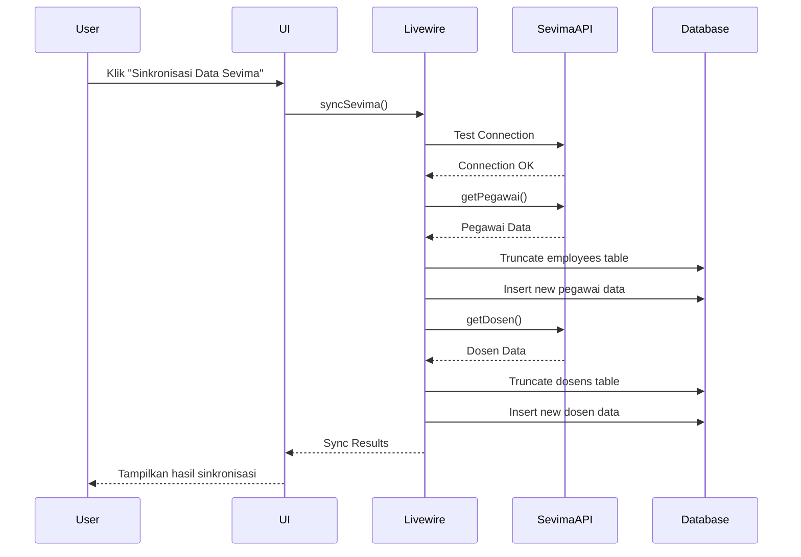
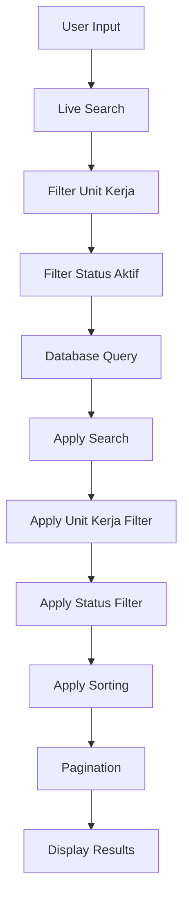
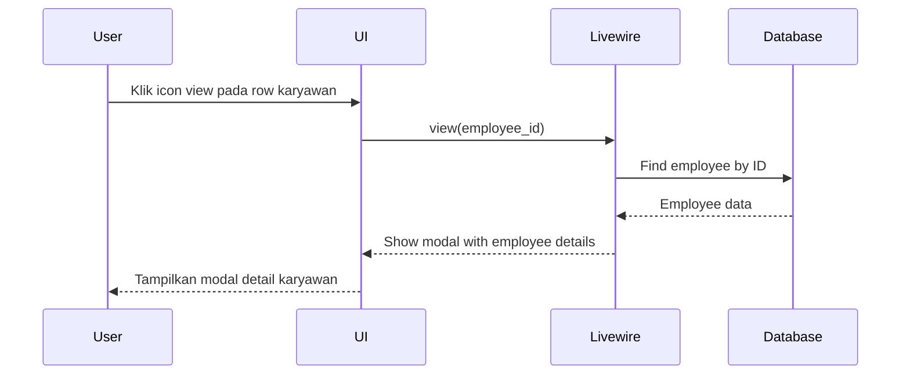

# Dokumentasi Halaman Data Karyawan

## Overview

Halaman Data Karyawan adalah modul dalam aplikasi USBYPKP yang digunakan untuk mengelola data karyawan dan informasi kepegawaian. Modul ini terintegrasi dengan API Sevima untuk sinkronisasi data karyawan dan dosen secara otomatis.

## Fitur Utama

### 1. Sinkronisasi Data dengan Sevima
- **Endpoint API**: `/pegawai` dan `/dosen`
- **Metode**: HTTP GET dengan autentikasi menggunakan App Key dan Secret Key
- **Proses Sinkronisasi**:
  - Menghapus data existing di database
  - Mengambil data terbaru dari API Sevima
  - Memetakan data API ke format database
  - Menyimpan data baru ke database

### 2. Manajemen Data Karyawan
- **Pencarian**: Berdasarkan nama, NIP, NIK, email, atau unit kerja
- **Filtering**: 
  - Filter berdasarkan unit kerja
  - Filter berdasarkan status aktif
- **Sorting**: Sortir berdasarkan berbagai kolom (nama, NIP, unit kerja, dll)
- **Pagination**: Navigasi halaman dengan opsi per halaman (10, 25, 50, 100)

### 3. Detail View Karyawan
- **Informasi Personal**: Nama lengkap dengan gelar, NIK, jenis kelamin, tanggal lahir, agama, status perkawinan, dll
- **Informasi Kepegawaian**: NIP, status kepegawaian, jenis pegawai, tanggal masuk/keluar, pangkat, jabatan, unit kerja
- **Informasi Kontak**: Email, email kampus, telepon, HP
- **Alamat**: Alamat KTP dan domisili lengkap
- **Pendidikan**: Pendidikan terakhir, jurusan, universitas, tahun lulus
- **Informasi Perbankan**: Data bank, rekening, BPJS, NPWP, status pajak

## Struktur File

### Backend Files

#### 1. Livewire Component
**File**: `app/Livewire/sdm/EmployeeManagement.php`

**Properties Utama**:
```php
// Filter dan Sorting
public $search = '';
public $perPage = 10;
public $sortField = 'nama_lengkap';
public $sortDirection = 'asc';
public $filterUnitKerja = '';
public $filterStatusAktif = '';

// State Sinkronisasi
public $isSyncing = false;
public $syncProgress = 0;
public $syncMessage = '';
public $syncResults = [];

// Modal State
public $showViewModal = false;
public $showEditModal = false;
public $viewEmployeeId;
public $viewEmployee;
```

**Methods Utama**:
- `syncSevima()`: Sinkronisasi data dari API Sevima
- `view($id)`: Menampilkan detail karyawan
- `create()`: Membuat karyawan baru
- `edit($id)`: Mengedit data karyawan
- `save()`: Menyimpan data karyawan
- `sortBy($field)`: Sorting data
- `resetFilters()`: Reset filter pencarian

#### 2. Model
**File**: `app/Models/Employee.php`

**Fillable Fields**:
```php
protected $fillable = [
    'nik', 'nama_lengkap', 'nama_panggilan', 'gelar_depan', 'gelar_belakang',
    'jenis_kelamin', 'tanggal_lahir', 'tempat_lahir', 'agama', 'status_perkawinan',
    'kewarganegaraan', 'golongan_darah', 'alamat_ktp', 'rt_ktp', 'rw_ktp',
    'kelurahan_ktp', 'kecamatan_ktp', 'kabupaten_ktp', 'provinsi_ktp', 'kode_pos_ktp',
    'alamat_domisili', 'rt_domisili', 'rw_domisili', 'kelurahan_domisili',
    'kecamatan_domisili', 'kabupaten_domisili', 'provinsi_domisili', 'kode_pos_domisili',
    'telepon', 'hp', 'email', 'email_kampus', 'nip', 'status_kepegawaian',
    'jenis_pegawai', 'tanggal_masuk', 'tanggal_keluar', 'status_aktif', 'pangkat',
    'jabatan_fungsional', 'jabatan_struktural', 'unit_kerja', 'fakultas', 'prodi',
    'pendidikan_terakhir', 'jurusan', 'universitas', 'tahun_lulus', 'nama_bank',
    'nomor_rekening', 'nama_rekening', 'bpjs_kesehatan', 'bpjs_ketenagakerjaan',
    'npwp', 'status_pajak', 'sevima_data', 'last_sync_at'
];
```

**Accessors**:
- `getNamaLengkapWithGelarAttribute()`: Menggabungkan nama dengan gelar depan dan belakang
- `getJenisKelaminTextAttribute()`: Konversi kode jenis kelamin ke teks
- `getStatusPerkawinanTextAttribute()`: Konversi kode status perkawinan ke teks

**Scopes**:
- `scopeActive()`: Filter karyawan aktif
- `scopeByUnitKerja()`: Filter berdasarkan unit kerja
- `scopeSearch()`: Pencarian multi-kolom

#### 3. API Service
**File**: `app/Services/SevimaApiService.php`

**Methods**:
- `getPegawai()`: Mengambil data pegawai dari API
- `getDosen()`: Mengambil data dosen dari API dengan pagination
- `testConnection()`: Test koneksi API
- `mapPegawaiToEmployee()`: Mapping data API ke model Employee
- `mapDosenToDosen()`: Mapping data API ke model Dosen

### Frontend Files

#### 1. Livewire View
**File**: `resources/views/livewire/sdm/employee-management.blade.php`

**Komponen Utama**:
- **Header Section**: Judul halaman dan tombol sinkronisasi
- **Sync Progress**: Progress bar dan status sinkronisasi
- **Sync Results**: Hasil sinkronisasi dengan statistik
- **Filters**: Form pencarian dan filter
- **Data Table**: Tabel data karyawan dengan pagination
- **View Modal**: Modal detail karyawan

#### 2. Main View
**File**: `resources/views/sdm/employees/index.blade.php`

Mengextends layout app dan menyertakan Livewire component:
```blade
<livewire:sdm.employee-management />
```

## Alur Kerja

### 1. Sinkronisasi Data



### 2. Pencarian dan Filtering



### 3. View Detail Karyawan



## Konfigurasi

### 1. Environment Variables
Tambahkan konfigurasi berikut di file `.env`:
```env
SEVIMA_BASE_URL=https://api.sevima.example.com
SEVIMA_APP_KEY=your_app_key
SEVIMA_SECRET_KEY=your_secret_key
```

### 2. Service Configuration
Konfigurasi di `config/services.php`:
```php
'sevima' => [
    'base_url' => env('SEVIMA_BASE_URL'),
    'app_key' => env('SEVIMA_APP_KEY'),
    'secret_key' => env('SEVIMA_SECRET_KEY'),
],
```

## Validasi Data

### Rules Validasi (EmployeeManagement.php)
```php
protected function rules()
{
    return [
        'nik' => 'required|string|max:20|unique:employees,nik,'.($this->employee_id ?? ''),
        'nama_lengkap' => 'required|string|max:255',
        'jenis_kelamin' => 'required|in:L,P',
        'tanggal_lahir' => 'required|date',
        'tempat_lahir' => 'required|string|max:100',
        'agama' => 'required|string|max:50',
        'status_perkawinan' => 'required|in:S,M,D,J',
        'kewarganegaraan' => 'required|string|max:50',
        'alamat_ktp' => 'required|string|max:255',
        'kelurahan_ktp' => 'required|string|max:100',
        'kecamatan_ktp' => 'required|string|max:100',
        'kabupaten_ktp' => 'required|string|max:100',
        'provinsi_ktp' => 'required|string|max:100',
        'kode_pos_ktp' => 'required|string|max:10',
        'tanggal_masuk' => 'required|date',
        'tanggal_keluar' => 'nullable|date|after_or_equal:tanggal_masuk',
        'status_aktif' => 'required|in:Aktif,Tidak Aktif',
        'unit_kerja' => 'required|string|max:100',
        'tahun_lulus' => 'nullable|integer|min:1900|max:'.(date('Y') + 5),
        // ... dan lainnya
    ];
}
```

## Error Handling

### 1. Sinkronisasi Error
- **Connection Error**: Tampilkan pesan "Gagal terhubung ke API Sevima"
- **Invalid Data Format**: Log error dan skip record bermasalah
- **Database Error**: Rollback transaction dan tampilkan pesan error

### 2. User-Friendly Error Messages
```php
private function formatUserFriendlyError($e)
{
    $errorMessage = $e->getMessage();
    
    // Mapping error messages
    if (strpos($errorMessage, 'connection') !== false) {
        return "Tidak dapat terhubung ke server Sevima. Periksa koneksi internet Anda.";
    }
    
    if (strpos($errorMessage, 'timeout') !== false) {
        return "Request timeout. Server Sevima sedang sibuk atau koneksi lambat.";
    }
    
    if (strpos($errorMessage, '401') !== false) {
        return "Autentikasi gagal. Periksa konfigurasi API key.";
    }
    
    return "Terjadi kesalahan: " . $errorMessage;
}
```

## Security Features

### 1. Authentication & Authorization
- Menggunakan Laravel authentication
- Role-based access control (SDM role)
- API key authentication untuk Sevima

### 2. Data Validation
- Server-side validation
- Client-side validation dengan Livewire
- Unique validation untuk NIK dan NIP

### 3. Logging
- Activity logging untuk setiap operasi
- Error logging untuk troubleshooting
- Sync result logging untuk audit

## Performance Optimization

### 1. Database Optimization
- Indexing pada kolom yang sering dicari
- Soft deletes untuk data integrity
- Proper pagination untuk large datasets

### 2. API Optimization
- Caching untuk frequently accessed data
- Batch processing untuk sinkronisasi
- Proper error handling untuk API failures

### 3. Frontend Optimization
- Live search dengan debounce
- Lazy loading untuk pagination
- Efficient DOM updates dengan Livewire

## Troubleshooting

### 1. Sinkronisasi Gagal
**Symptoms**: Error message saat sinkronisasi
**Solutions**:
- Periksa koneksi internet
- Verifikasi API key dan secret key
- Cek status API Sevima
- Lihat log files untuk detail error

### 2. Data Tidak Muncul
**Symptoms**: Tabel kosong setelah sinkronisasi
**Solutions**:
- Pastikan sinkronisasi berhasil
- Cek filter pencarian
- Verifikasi data di API Sevima
- Lihat database logs

### 3. Performance Issues
**Symptoms**: Halaman lambat saat loading
**Solutions**:
- Periksa database indexes
- Optimalkan query dengan proper scopes
- Cek server resources
- Implement caching jika needed

## Future Enhancements

### 1. Export/Import Features
- Export data ke Excel/CSV
- Import data dari file
- Template import dengan validation

### 2. Advanced Filtering
- Date range filtering
- Multi-select filters
- Custom filter combinations

### 3. Reporting
- Generate reports kepegawaian
- Statistical dashboards
- PDF export capabilities

### 4. Integration Features
- Integration dengan payroll system
- Integration dengan attendance system
- Integration dengan HRIS modules

## Best Practices

### 1. Code Organization
- Gunakan proper naming conventions
- Separation of concerns antara logic dan presentation
- Comment code yang kompleks

### 2. Database Design
- Gunakan proper data types
- Implement soft deletes
- Add proper indexes

### 3. API Integration
- Handle API errors gracefully
- Implement retry logic
- Log all API interactions

### 4. User Experience
- Provide loading states
- Show progress indicators
- Give clear feedback to users

## Testing

### 1. Unit Tests
- Test model methods dan accessors
- Test API service methods
- Test validation rules

### 2. Feature Tests
- Test CRUD operations
- Test search and filter functionality
- Test sync process

### 3. Browser Tests
- Test user interactions
- Test responsive design
- Test cross-browser compatibility

## Deployment

### 1. Requirements
- PHP 8.0+
- Laravel 9+
- MySQL 8.0+
- Redis (optional untuk caching)

### 2. Environment Setup
- Set proper environment variables
- Configure database connections
- Set up API credentials

### 3. Migration Commands
```bash
php artisan migrate
php artisan db:seed --class=EmployeeSeeder
```

### 4. Maintenance
- Regular database backups
- Monitor API usage
- Update dependencies regularly
- Monitor application performance

---

Dokumentasi ini mencakup semua aspek pengembangan dan penggunaan halaman Data Karyawan. Untuk informasi lebih lanjut atau jika ada pertanyaan, silakan hubungi tim pengembang.
